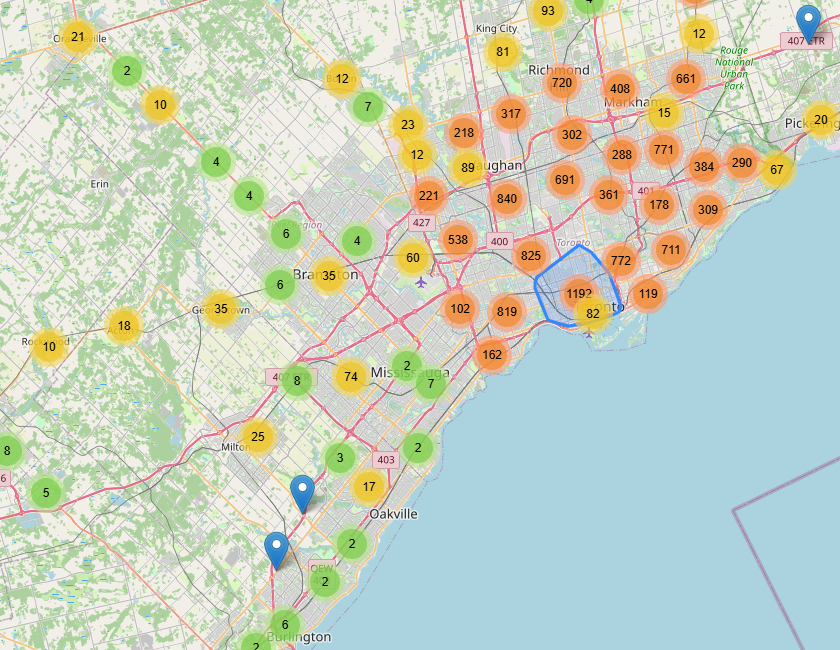
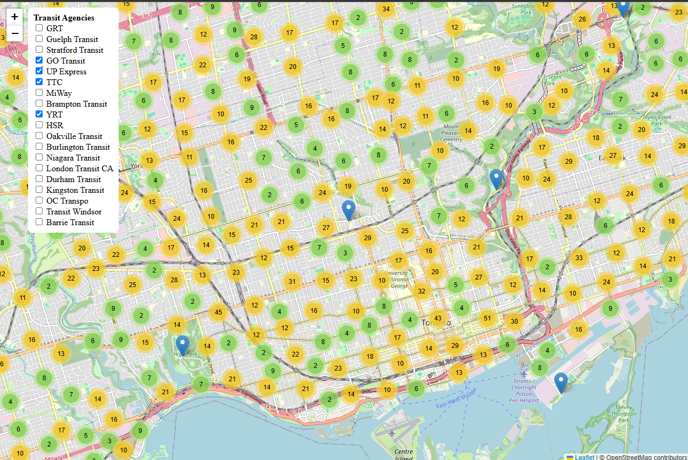
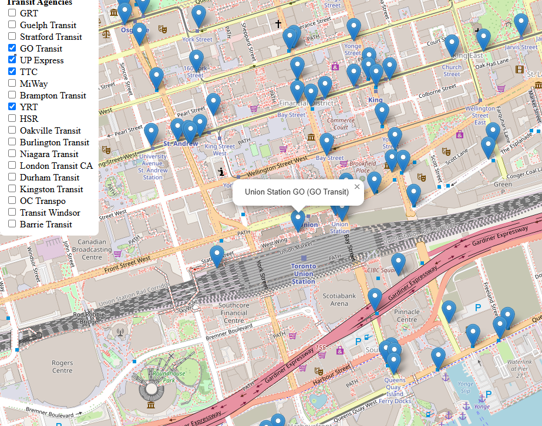

# Southern Ontario Transit Stops

This is just a simple web page showing almost all transit stops in southern Ontario. As of now, there are a few agencies who don't publish publicly accessible data, or make it difficult to attain.

Major transit agencies included include YRT, TTC, OC Transpo, MiWay, GRT, and HSR.

## Development

This project was an absolute pain to develop. This was primarily because of the fact that my web dev experience is next to none, and thus me deciding to straight up dive into this project was probably a pretty stupid idea. It seems to make a lot more sense to have started with a simpler project, such as a personal website, but no, stupid old me thought it would be easy enough to make, and tryed anyways.

In general, most aspects were ok, but if you are to view the [demo](https://transit-webapp-grt.vercel.app/), you will definitely notice that it is very, very slow to load all of the agencies. In addition, it consumes enormous amounts of RAM, to the tune of 2 GB, which your computer may not be able to handle.

Thankfully, I have some experience in C and Python, and thus I was able to kind of get the hang of the new language and roll with it! I did, however, end up relying quite a bit on AI for debugging (and occasionally coding), as this is way above my pay grade. 

After that challenge, there was the GTFS.

### GTFS

The problem with quite a few transit agencies is that they straight up do not (at least it seems) want you to get your hands on GTFS data.

What I mean by this is that for more than one transit agency they put their data behind registration walls, where, believe it or not, they *asked for the company I worked with*. As an open source developer, that was honestly kind of insulting. On the other hand, there were several agencies where they clearly said that this data is open for all to use, beit citizens, or companies.

## Running the Project

As far as web pages go, this is a pretty standard project to run, you simply visit the [website](https://transit-webapp-grt.vercel.app/), and click on the different transit agencies to enable the markers.

Let's take the TTC for example.

After clicking the TTC's check box, you will, albeit after it lagging out for a few seconds, come to see the bus stops. As rendering every single stop would be a pretty stupid idea, it shows something like the following.

![A web map of southern Ontario with a left sidebar list titled Transit Agencies showing multiple agency checkboxes and the TTC box checked; the map displays clustered circular orange and yellow markers over the Greater Toronto Area with numbers indicating stop counts such as 31, 98, 179, 382, 643, 823, 772, 708, 1187, and others. The map background shows roads, towns, and Lake Ontario and labels for Brampton, Mississauga, Vaughan, Markham, Toronto, Oakville, Burlington, and Hamilton. The left sidebar transcribed text: Transit Agencies, GRT, Guelph Transit, Stratford Transit, GO Transit, UP Express, TTC (checked), MiWay, Brampton Transit, YRT, HSR, Oakville Transit, Burlington Transit, Niagara Transit, London Transit CA, Durham Transit, Kingston Transit, OC Transpo, Transit Windsor, Barrie Transit. The visual tone is informational and technical, focusing on data density and geographic distribution of transit stops.](image.png)

Next up, if want to zoom in onto the stops, you can easily just click one of the clusters, or naturally zoom into the area you are interested in.

Lets take downtown toronto for this example. Please note that YRT, UP Express and GO transit have also been enabled.

Here, I have my mouse hovering over the downtown area showing 1192 stops. You can see how the area around the area in which these stops are in has become blue.

Clicking on it gives you the following picture!

Next, if you so desire, you can continue to do this on and on until you find a place you like!

### Zoom

To Zoom in and out, it is honestly quite intuitive, simple press the '+' button to zoom in and the '-' button to zoom out. With your mouse, you can simply scroll up to zoom in and down to zoom out.

### Stop information

Every stop comes with stop information, and this can be gotten by clicking on the stop! Its quite simple, and for this example we'll take the GO Transit stop at Union Station.

The format in which information is given is simply Station Name (Agency)

## AI

As mentioned, AI was used for parts of the code. This was primarily in the App.jsx file's checklist function and template.

All the GTFS files were manually sourced, consuming likely the most amount of time, and the loadStops function is likely my greatest achievement, considering how little experience I have!

No part of this readMe, except alt text, was generated by AI.

## Demo

You can take a look and explore the page yourself at [https://transit-webapp-grt.vercel.app/](https://transit-webapp-grt.vercel.app/)